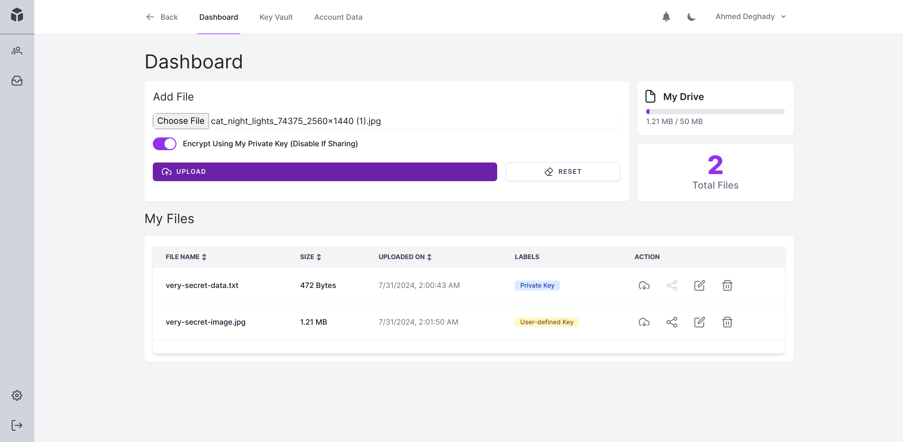
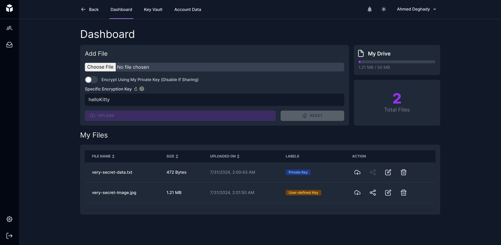
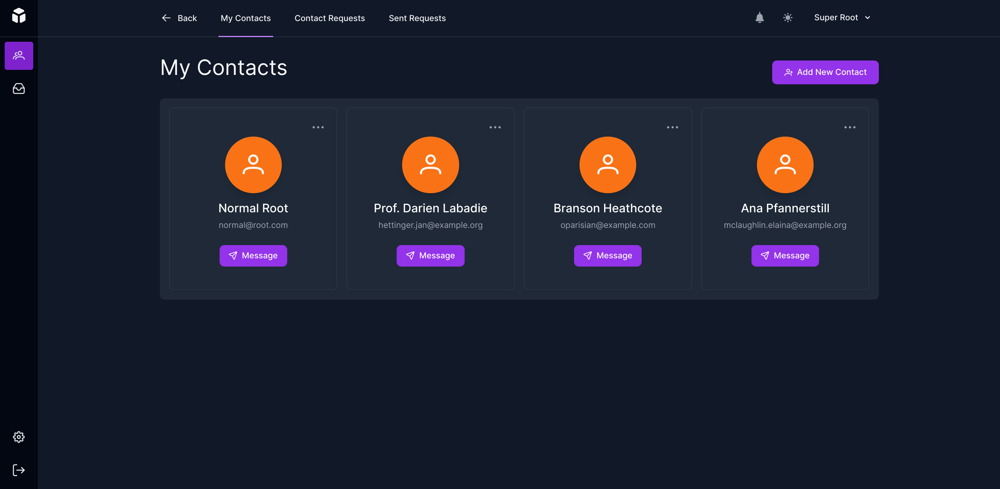
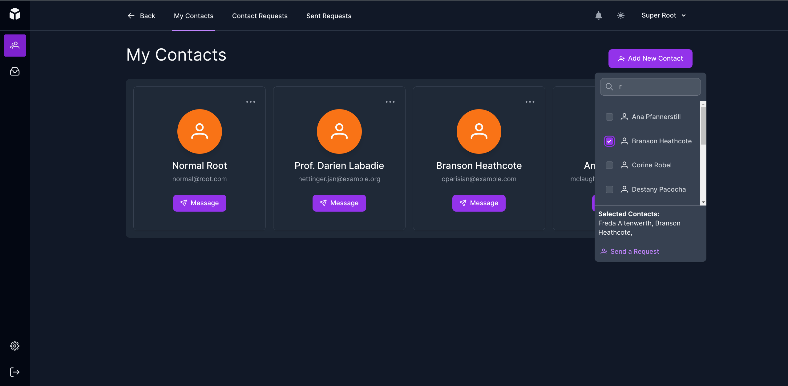
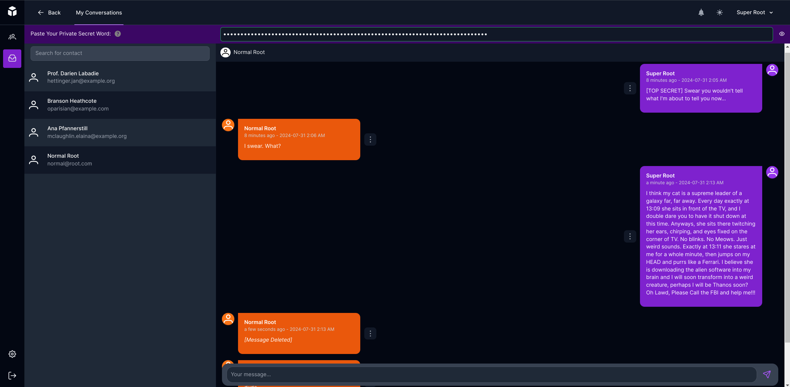

<div align="center">  
 
</div>

# 👇MyRepo – Military Grade Security Cloud Storage System
MyRepo is an open-source, end-to-end encryption cloud storage system similar to well-known systems like [Google Drive](https://www.google.com/drive/), [iCloud](https://www.icloud.com/), and [Dropbox](https://www.dropbox.com/). However, MyRepo offers the advantage of encrypting files on the client side before uploading them to the server. This approach protects against data leakage and first-party/third-party data sales, ensuring that even if you lose your account, your data remains secure and indecipherable. 

With MyRepo, you **OWN** your data, and the provider only stores it without knowledge of its contents.

# Live Demo
https://myreporemastered.online/
>Note: This is a demo version of the project. Your data is subject to deletion at any time.

# 📋Contents
- [Features](#features)
- [How it works](#-how-it-works)
- [Chat Encryption](#encrypting-chat)
- [Screenshots](#screenshots)
- [Installation](#installation)
- [Known Issues](#known-issues)
- [Report a bug](#found-a-bug)
- [Help Us Grow](#help-us-grow)
- [License](#license)

# ⭐Features:
* Server-Know-Nothing Model: Ensures the server has no knowledge of the user's data.
* Anti-Data-Leakage System: Protects against unauthorized data access.
* Anti-Man-in-the-Middle Attack: Secures data against interception during transfer.
* Encrypted File Share: Enables secure file sharing with other parties.
* Encrypted End-to-End Chat: Provides military-grade secure communication.
* Real-Time Chat: Allows users to chat in real-time.
* Real-Time Notifications: Notifies users of incoming messages.
* Responsive Design: Works on all devices.

# 🔧 How it works
The main idea behind MyRepo is to create a system that provides a military-grade security storage system in such a way that even in the event of unauthorized access to a user account or to the server by administrators, the content remains indecipherable.

How does MyRepo work?
The main idea is Hybrid Encryption, which is similar to using two locks to protect your valuables. That's why MyRepo uses Elliptic Curve Integrated Encryption Scheme (ECIES), a hybrid encryption scheme that combines the speed of symmetric encryption with the security of public-key encryption. Elliptic Curve Cryptography (ECC) is used to generate the keys for the encryption and decryption process, and the Advanced Encryption Standard (AES) is used to encrypt and decrypt the data.

These two schemes were the most suitable choices for MyRepo. ECC's ability to generate secure keys with low latency and AES's unbreakable nature make them most suited for data and file encryption, ensuring that any file a user uploads cannot and will not be accessed by an unauthorized entity.

How is it implemented?
Similar to crypto wallets, MyRepo uses ECC and mnemonic generation with every new user created. Users have to enter 12 words that will later be used for generating the private key and two public keys. It is strongly recommended to store these words on paper, as they are shown only once. If a user loses them, their account and data will be inaccessible.

Why are there two public keys? MyRepo offers file sharing and chat features. The ECDH key is used to derive the shared key between two users to encrypt and decrypt chat messages. The EdDSA key is used to sign the encrypted messages to ensure the integrity of the messages between the parties.

File uploading
MyRepo's encryption happens on the client's side, which ensures the following:
- "Server-Knows-Nothing" Model: It is one of MyRepo's principles to ensure that uploaded data is totally unreadable before it reaches the server.
- Protection from "Man-in-the-middle attack": As data is encrypted before being uploaded on the internet, a hacker can't read or decrypt the data unless they have the private key (which is impossible unless the data's owner managed to leak it themselves).

Basically, the user uses their private key and injects it into the AES function to encrypt the target file. This is how it looks like.

<details>
<summary>Click to a sample code</summary>

```javascript 
const mnemonicSeed = "sunrise table mountain tourist carbon fire crystal dragon artwork daemon pistol broccoli" || await fancyPrompt('Enter your Secret Phrase:', 'Example: sunrise table mountain tourist carbon fire crystal dragon artwork daemon pistol broccoli'
const private = await getPrivateKey(mnemonicSeed);
key = generateKey();
fileForm.key = CryptoJS.AES.encrypt(key, privateKey).toString(); // Encrypt a randomly generated key with the ECDH private key
const wordArray = CryptoJS.lib.WordArray.create(file);
form.file = new Blob([CryptoJS.AES.encrypt(wordArray, key).toString()]);
form.checksum = CryptoJS.MD5(wordArray.toString()).toString() // MD5Sum
form.post(route('store-file'), {
 preserveScroll: true,
 onError: (e) => {
 Toast.fire({
 icon: 'error',
 title: Object.values(e)
 });
 },
 onSuccess: () => {
 document.getElementById('file-input').value = '';
 fileForm.reset();
 Toast.fire({
 icon: "success",
 title: "File uploaded successfully!"
 });
 }
});
```
</details>

---

## Chat Encryption
MyRepo offers a secure end-to-end chat between two users. Here's how it works:

- User A wants to say "Hello Kitty" to User B.
- User A uses his private ECDH Key with User B's public ECDH Key to derive the shared key between him and User B.
- User A signs the plain message with his private EdDSA Key.
- User A encrypts "Hello Kitty" with the shared key.
- User A sends the encrypted message and the signature to User B.
- User B uses his private ECDH Key with User A's public ECDH Key to derive the shared key between him and User A.
- User B decrypts the message with the shared key.
- User B verifies the decrypted message with the signature using User A's public EdDSA Key.
- User B is happy to see "Hello Kitty" decrypted and validated.

# Screenshots







# Tools & Frameworks
- Php Laravel
- Vue.js
- CryptoJS
- Elliptic
- Tailwind CSS

# Installation
Now that you know how MyRepo works, you can install it on your server. Here's how you can do it:

This project is built using Laravel 11, Vue 3, Inertia.JS, and TailwindCss.
### Prerequisites
- PHP 8.2 or higher
- Composer
- NPM
- PostgreSQL (not tested with MySQL)

```
 git clone https://github.com/ahmed-fawzy99/my-repo.git
 cd my-repo
 composer install
 cp .env.example .env 
 ```
Then open `.env` file and fill in your database credentials.

- Make sure `QUEUE_CONNECTION=database` is set for queues.

- This app uses pusher for real-time chat and notifications, so you need to create an account on pusher and fill in the credentials in the `.env` file. If you don't want to use pusher, you can ignore this step, but the real-time updates will not work.

- Also, the users must verify their email addresses, so you need to fill in the SMTP credentials in the `.env` file. If you don't want to use email verification, go to `User` model and remove the `MustVerifyEmail` interface.


We need to generate the application key:
```
 php artisan key:generate
 ```

Make a symbolic link to the storage directory:
```
 php artisan storage:link
```

To generate basic data needed to start the system, we need to run the migrations and starter seeder:
```
 php artisan migrate --seed
```

You will need to run the queue for task scheduling and queues, and leave it running:
```
 php artisan queue:work
```

For Client-side Dependencies:
```
 npm install
```

**If you are running this app for development, you can use the following command to start the server:**
```
 npm run dev
```
```
 php artisan serve
```

**If you are running this app for production, you can use the following command to build the assets:**
```
 npm run build
```
And finally, configure your web server to point to the `public` directory of the project.

Don't forget to change the `APP_ENV`, `APP_DEBUG`, and `APP_URL` in the `.env` file for production.


# Known Issues
Performance issues may occur when dealing with files over 100 MB on older machines, as the encryption process is done on the client side. However, the main purpose of MyRepo is to ensure the security of sensitive data, which is usually small in size.

# Found a Bug?
If you find any issues or would like to suggest an improvement for this project, please share it with us by opening an issue.

# Help us Grow
Our project is open-source, and we are always looking for contributors to help us grow and improve our project. If you are interested in contributing, please feel free to fork the project and submit a pull request.

Also, we want to buy a more performant server to host our project, so help spread the word and support more users. If you would like to support us, please consider buying us a coffee.

Finally, if you like our project, please give us a star to show your support.

# License
This project is licensed under The MIT License.
